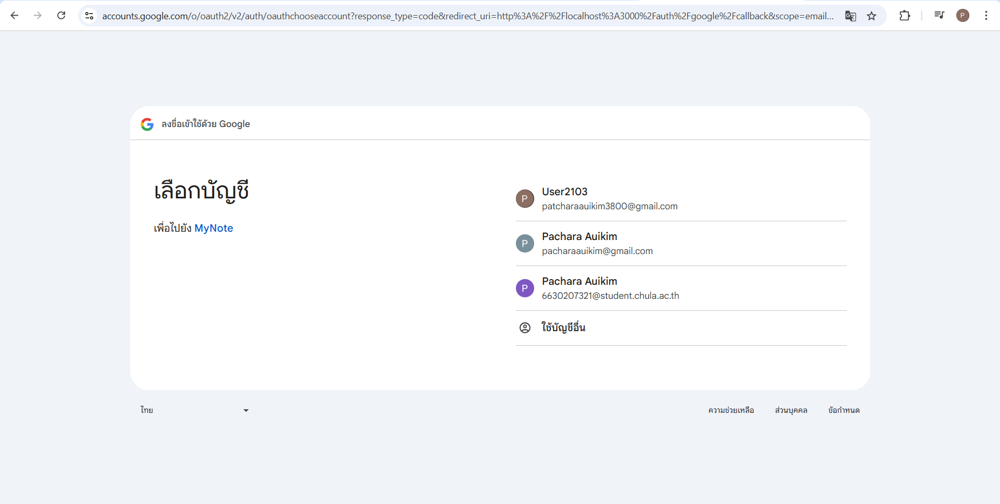
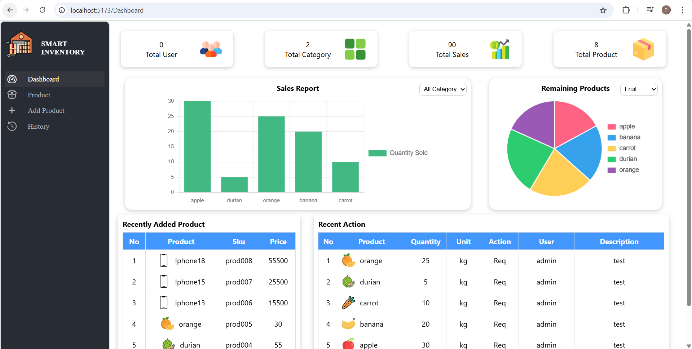
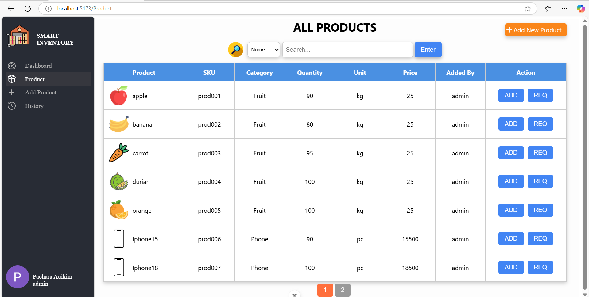
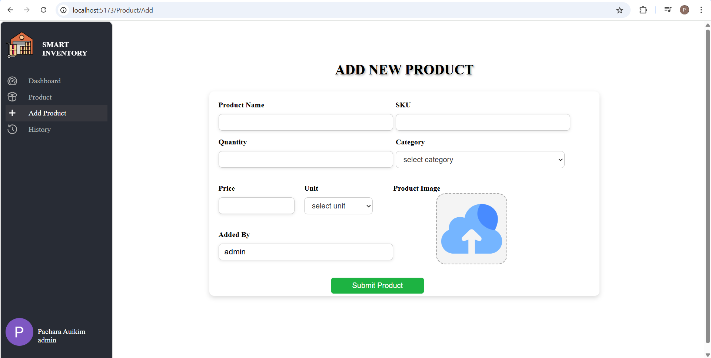
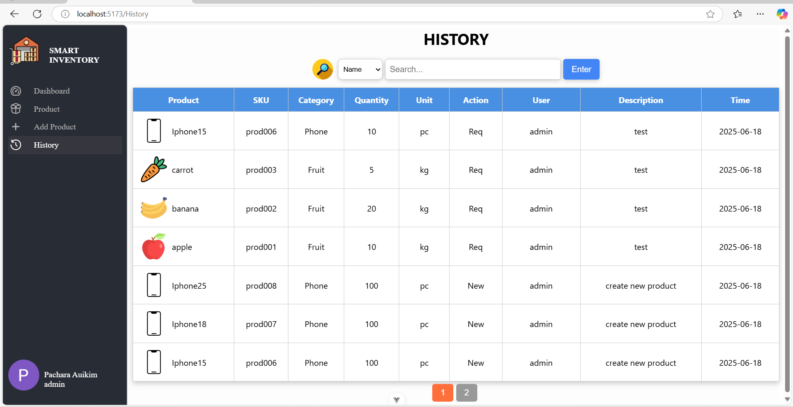

## About The Project
This is my first personal project using Nest.js, Vue.js, and Terraform. It was created for the purpose of practicing with these. The project, Smart Inventory, is an inventory management system where users can request and add products. It also includes a dashboard that displays product sales, product categories, and other data through graphs. Additionally, there are Product and History pages, which show all products and the actions taken by users, respectively.

### 🛠 Tech Stack
- Backend: [NestJS](https://nestjs.com/)
- Frontend: [Vue.js 3](https://vuejs.org/)
- Infrastructure as Code: [Terraform](https://www.terraform.io/)
- Database: MongoDB
- Others: Docker, Docker Compose, Github

## Smart Inventory
### Login
<p align="center">
  
  
</p>

#### ✨ Features
- Support Google login
- Implement JWT authentication with cookie validation for protected routes

### Dashboard

#### ✨ Features
- Display sales and remaining products through graphs
- Display total users, categories, sales, and products
- Show recently added products and recent actions in a table

### Product

#### ✨ Features
- View all products in a table
- Search for products using keywords

### Add Product

#### ✨ Features
- Add a new product with an image uploaded and stored on the backend in the format `[sku].png`

### Historry

#### ✨ Features
- View history in a table
- Search for history using keywords

## 🚀 Getting Started
#### Using Docker Compose
 ```sh 
 git clone https://github.com/Pachara2103/smart-inventory 
 ```
  ```sh 
 cd smart-inventory
 ```
  ```sh 
 docker compose up -d
 ```
#### available at http://localhost:5173/

### Challenges
#### Problem: เนื่องจากเป็นการใช้ NestJS, Vue & Terraform ครั้งเเรก ในช่วงเเรกจึงยากไปหมด
- Sol. ค่อยๆเรียนรู้ เเละศึกษาวิธีการใช้สิ่งต่างๆจาก Youtube & Chat GPT พอหลังๆ เริ่มเข้าใจอะไรมากขึ้นก็ไปได้ไวขึ้น 
#### Problem: ปัญหาในการใช้ Docker Compose เชื่อมต่อ MongoDB 
- Sol. ศึกษาหาตัวอย่างของคนอื่นมาเรียนรู้ เเละปรับใช้กับตัวเอง 

### Lessons Learned
- เรียนรู้การเชื่อม frontend-backend ด้วย REST API
- ได้เรียนรู้การใช้ Nestjs ในการทำ Authentication การใช้สื่อสารกับ  frontend เเบบ REST API เเละการเชื่อมกับ MongoDB
- ได้เรียนรู้การใช้ Vue ในการทำ pages ต่างๆ เเละการสื่อสารกับ backend เเบบ REST API
- เรียนรู้การใช้ terraform เบื้องต้น
- เรียนรู้วิธีการเขียน Dockerfile & Docker Compose

### Future Improvements
- เพิ่มระบบ login ให้หลากหลาย โดยที่ไม่ได้มีเเค่ google login
- Deploy ด้วย CI/CD
- การวางโครงสร้างแอปที่ดี for better perfomance เช่น การที่ทำซ้ำ component หลายๆอัน ควรใช้ for ไม่ควรเขียนซ้ำทุกครั้ง 

### Contact
- Gmail: patcharaauikim3800@gmail.com


